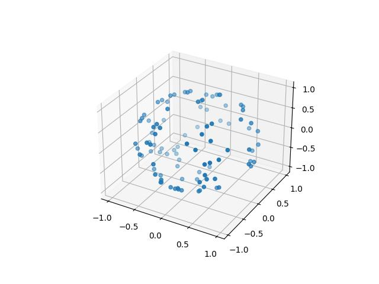

# Vulky notebooks

Examples showing *vulky* and how to create rendering applications in few lines of code.
Vulky exposes a simplified view of Vulkan API, but at the same time is compact, elegant and
with little overhead.

In google colab execute next cell to install all dependencies:

```shell
!sudo apt-get update
!sudo apt-get install vulkan-tools glslang-tools libvulkan-dev vulkan-validationlayers-dev spirv-tools
!pip install pyav
!git clone https://github.com/rendervous/vulky
```

<table>
<tr>
<td>
    <a href="./e01_create_and_destroy_device.ipynb">
    
    </a>
</td>
<td>
    <b>Devices:</b> Creating and destroying devices in vulky, manipulating vectors and matrices.<br/>
    <a href="https://colab.research.google.com/github/rendervous/vulky_examples/blob/main/e01_create_and_destroy_device.ipynb">open in colab</a>
</td>
</tr>

<tr>
<td>
    <a href="./e02_basic_compute.ipynb">
    
    </a>
</td>
<td>
    <b>Basic Compute:</b> Computing the Mandelbrot set to an image.<br/>
    <a href="https://colab.research.google.com/github/rendervous/vulky_examples/blob/main/e02_basic_compute.ipynb">open in colab</a>
</td>
</tr>

<tr>
<td>
    <a href="./e03_basic_rasterization.ipynb">
    
    </a>
</td>
<td>
    <b>Basic Rasterization:</b> Drawing primitives to a framebuffer with depth-test.
</td>
</tr>

</table>


